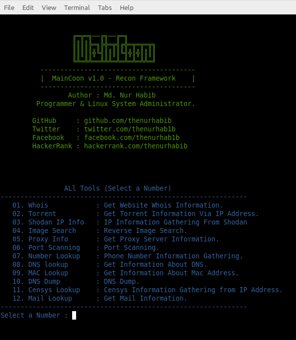

#

# MainCoon - Recon Framework.

### MainCoon is an automated recon framework meant for gathering information during penetration testing of web applications.


<br>
<br>

## All Features
```yaml

01. Whois            : Get Website Whois Information.     
02. Torrent          : Get Torrent Information Via IP Address.             
03. Shodan IP Info   : IP Information Gathering From Shodan
04. Image Search     : Reverse Image Search.
05. Proxy Info       : Get Proxy Server Information.
06. Port Scanning    : Port Scanning.
07. Number Lookup    : Phone Number Information Gathering.
08. DNS lookup       : Get Information About DNS.
09. MAC Lookup       : Get Information About Mac Address.
10. DNS Dump         : DNS Dump.
11. Censys Lookup    : Censys Information Gathering from IP Address.
12. Mail Lookup      : Get Mail Information.

```
<br>

### Login Information 

```yaml
login Username : habib@user
Login Password : habib@pass
```

<br>

` Disclaimer  : This tool made for only educational purpose please don't use it for any bad purpose.`

<br>

## Usage.


```yaml
 apt-get update
 apt-get upgrade
 pkg install git
 pkg install python3
 pip install -r requirements.txt
 git clone https://github.com/thenurhabib/maincoon
 cd maincoon
 python3 maincoon.py

```


## Screenshot




## 🔗 Links

[](https://www.nurhabib.ml/)
[](https://twitter.com/mdnurhabib)
[](https://hackerrank.com/thenurhabib)

## 🚀 About Me
I'm a programmer and Linux System Administrator.


## Author

```yaml
GitHub     : https://github.com/thenurhabib
Facebook   : https://web.facebook.com?thenurhab1b 
HackerRank : https://www.hackerrank.com/thenurhabib
```
<br>


# <strong> <center> Thank You. </center> <strong>
